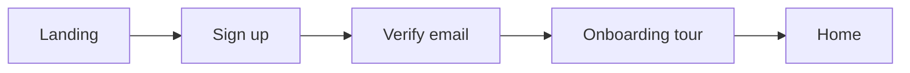
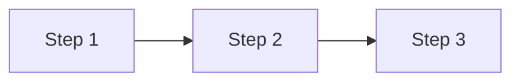

# [Product / Feature Name] — App Flow & User Journeys

## Onboarding & Authentication Flow
Sign-up, login, password recovery, MFA, initial setup/tour — as a flow diagram plus notes.

## Core Feature Loops
One subsection per loop.

### [Loop name]
**Implements:** `US-01`

## Screen-by-Screen Map
| Screen | Route | Type | Reached from | Implements | Purpose |
|---|---|---|---|---|---|
| | `/path` | view / modal / slide-over | | `US-01` | |

## State & Edge Logic
Per screen or control: loading, empty, and error states, and what each action does.

### [Screen name]
- **Loading:** ...
- **Empty:** ...
- **Error:** ...
- **[Control] click:** ...
