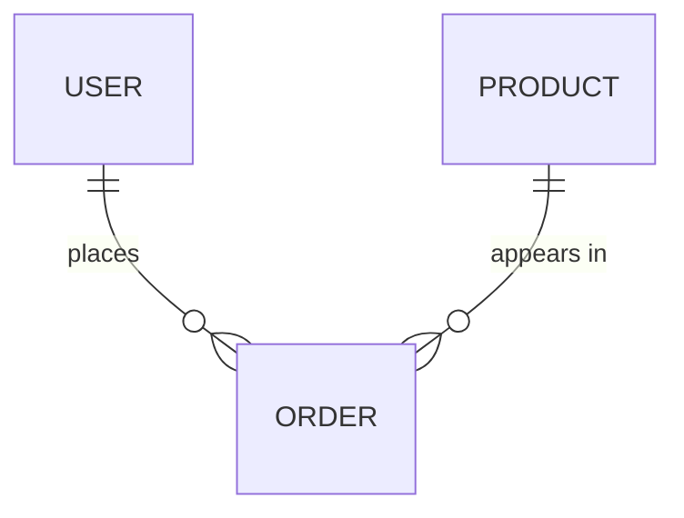

# [Product / Feature Name] — Data Schema & Model Specification

## Entity-Relationship Overview

## Tables
| Table | Implements | Summary |
|---|---|---|
| `users` | `FR-01` | ... |

### `[table_name]`
| Field | Type | Nullable | Default | Notes |
|---|---|---|---|---|

**Relationships:** FK, cardinality, cascade rule.
**Indexes & constraints:** PK, unique, composite, check.

## Data Lifecycle Strategy
Soft vs. hard deletes, auditing fields, migration strategy.
