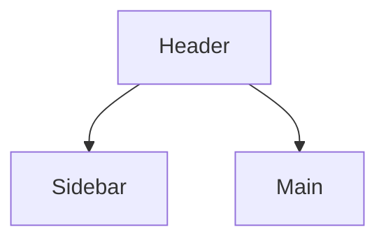

# [Product / Feature Name] — Design Brief & UI System

## Look & Feel / Brand Identity
Tone, visual direction, mood, references.

## Design Tokens

### Color Palette
| Token | Hex | Usage |
|---|---|---|
| `primary` | | |
| `success` | | |
| `warning` | | |
| `error` | | |

### Typography
| Token | Font | Weight | Size | Line height |
|---|---|---|---|---|

### Spacing & Grid
Base unit, scale, breakpoints (mobile, desktop).

## Accessibility
Conformance target and verification live in [`nfr.md`](nfr.md); this section holds what the tokens and components must satisfy to meet it.

### Contrast
| Foreground | Background | Ratio | Passes |
|---|---|---|---|
| `text` | `surface` | | AA (4.5:1 body, 3:1 large) |

### Interaction
- **Focus:** visible focus indicator on every interactive element, and its token
- **Keyboard:** traversal order and escape/dismiss behavior for modals and slide-overs
- **Target size:** minimum hit area
- **Motion:** `prefers-reduced-motion` fallback for each animated pattern

## UI Component Library
| Component | States | Notes |
|---|---|---|
| Button | default / hover / focus / disabled | |

## Screen Layout Templates
One subsection per template, referencing the screen types in `app-flow.md`.

### [Template name — e.g. Dashboard]

Grid, breakpoint behavior, and the loading/empty/error variant.
