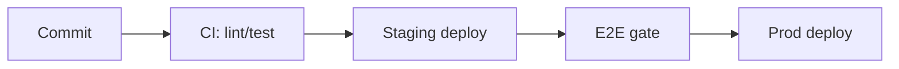

# [Product / Feature Name] — NFRs & Operational Strategy

## Performance Targets
| ID | Metric | Target |
|---|---|---|
| `NFR-01` | API p95 latency | |
| `NFR-02` | Throughput | |
| `NFR-03` | Initial load | |

## Security & Compliance
| ID | Requirement | Detail |
|---|---|---|
| `NFR-04` | Encryption in-transit / at-rest | |
| `NFR-05` | Authentication rules | |
| `NFR-06` | Access control (RBAC) | |
| `NFR-07` | Compliance mandates | |

## Accessibility
| ID | Requirement | Detail |
|---|---|---|
| `NFR-08` | Conformance target | e.g. WCAG 2.2 AA |
| `NFR-09` | Verification | Automated checks in CI, manual keyboard/screen-reader pass |

Token-level constraints (contrast pairs, focus states, motion) live in [`design-brief.md`](design-brief.md).

## DevOps & Deployment Pipeline
Local → staging → production setup; CI/CD steps; testing gates; rollback procedure.

## Observability & Reliability
| ID | Requirement | Detail |
|---|---|---|
| `NFR-10` | Structured logging strategy | |
| `NFR-11` | Error reporting target | |
| `NFR-12` | Telemetry | |
| `NFR-13` | Uptime expectation | |
