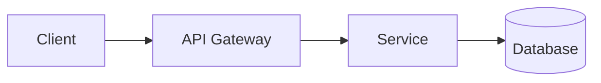
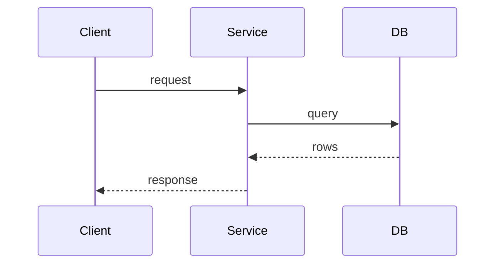

# [Product / Feature Name] — Technical Design Document

## Architecture Overview
Monolith / microservices / serverless; frontend vs. backend layout; communication channels.

### Key Flows
One `sequenceDiagram` per flow whose ordering across components isn't obvious from the diagram above (auth handshake, payment capture, async job).

## Tech Stack Selection
| Layer | Choice |
|---|---|
| Frontend framework | |
| Backend runtime | |
| Database | |
| Caching | |
| Hosting | |

## Third-Party Tools & Services
| Service | Purpose | Provider |
|---|---|---|
| Auth | | |
| Payments | | |
| Email/notifications | | |

## Key Technical Decisions (ADRs)
| ADR | Decision |
|---|---|
| [ADR-001](../adr/0001-....md) | ... |
